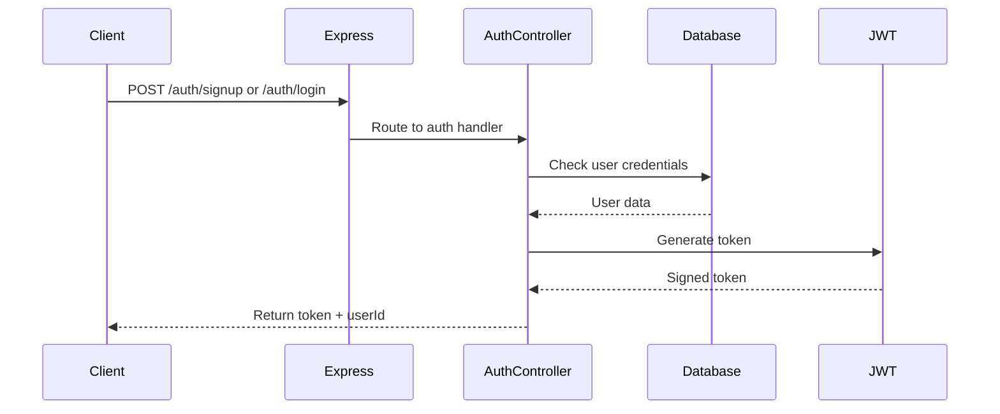
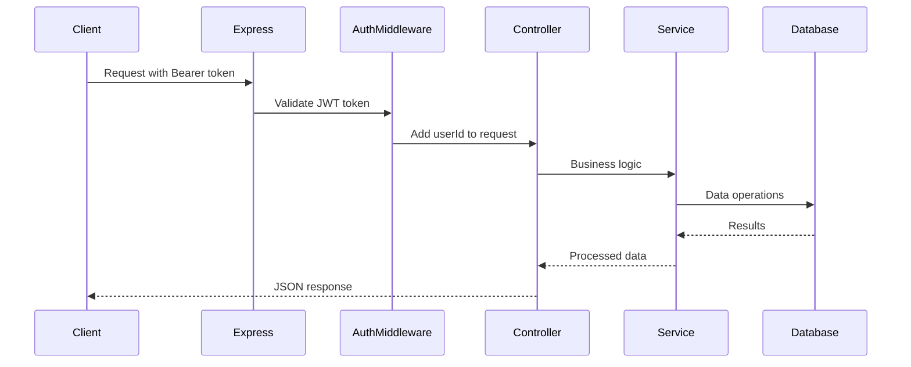
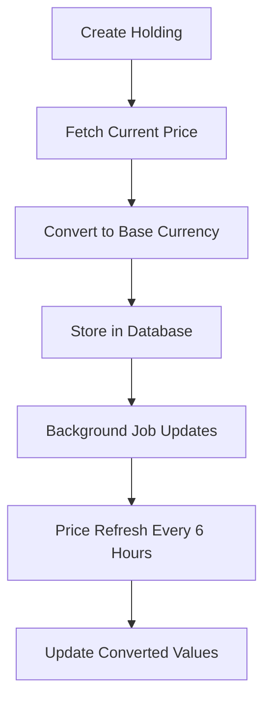
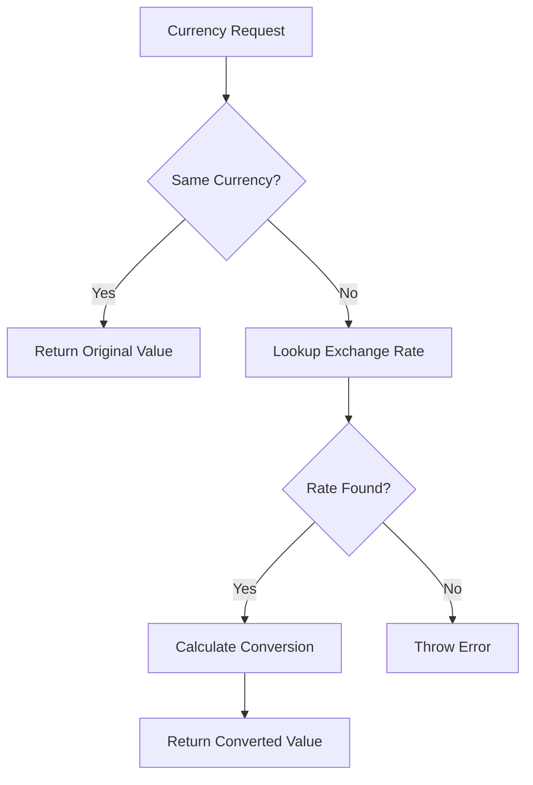
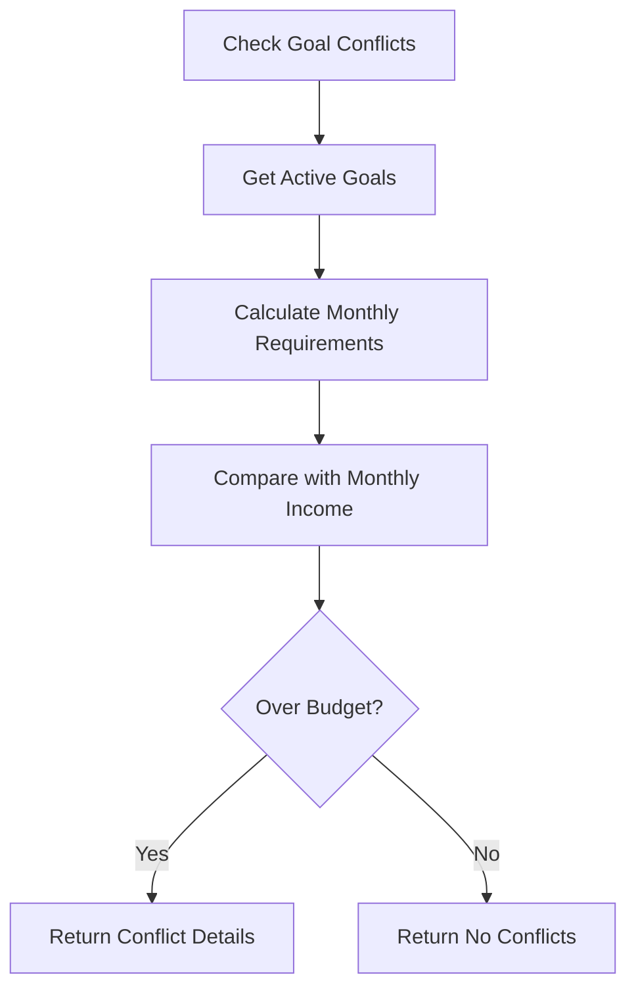

# Azerro Backend - Architecture & Flow Logic Documentation

## 🏗️ System Architecture Overview

The Azerro backend follows a **layered architecture pattern** with clear separation of concerns, built using Node.js, Express.js, TypeScript, and PostgreSQL with Prisma ORM.

### Architecture Layers

```
┌─────────────────────────────────────────────────────┐
│                   Client Layer                      │
│            (Web/Mobile Applications)                │
└─────────────────────────────────────────────────────┘
                            │
                   HTTP/HTTPS Requests
                            │
┌─────────────────────────────────────────────────────┐
│                 API Gateway Layer                   │
│              (Express.js Router)                    │
│         • CORS • JSON Parsing • Routes             │
└─────────────────────────────────────────────────────┘
                            │
┌─────────────────────────────────────────────────────┐
│               Middleware Layer                      │
│           • Authentication (JWT)                    │
│           • Error Handling                          │
│           • Request Validation                      │
└─────────────────────────────────────────────────────┘
                            │
┌─────────────────────────────────────────────────────┐
│                Controller Layer                     │
│        • Request/Response Handling                  │
│        • Input Validation                           │
│        • Business Logic Orchestration               │
└─────────────────────────────────────────────────────┘
                            │
┌─────────────────────────────────────────────────────┐
│                Service Layer                        │
│         • Business Logic                            │
│         • External API Integration                  │
│         • Currency Conversion                       │
│         • Price Updates                             │
└─────────────────────────────────────────────────────┘
                            │
┌─────────────────────────────────────────────────────┐
│                Data Access Layer                    │
│              (Prisma ORM)                           │
│         • Database Operations                       │
│         • Query Optimization                        │
│         • Transaction Management                    │
└─────────────────────────────────────────────────────┘
                            │
┌─────────────────────────────────────────────────────┐
│                Database Layer                       │
│               (PostgreSQL)                          │
│         • Data Persistence                          │
│         • Relationships                             │
│         • Constraints                               │
└─────────────────────────────────────────────────────┘
```

## 📁 Project Structure

```
src/
├── controllers/          # Request handlers and response logic
├── routes/              # API endpoint definitions
├── services/            # Business logic and external integrations
├── middlewares/         # Request processing middleware
├── utils/               # Utility functions and helpers
├── jobs/                # Background job definitions
└── scripts/             # Database seeding and maintenance
```

## 🔄 Request Flow Architecture

### 1. Authentication Flow


### 2. Protected Resource Flow


## 🔧 Core Components

### 1. Server Configuration (`src/index.ts`)
**Purpose**: Application bootstrap and configuration

**Key Features**:
- Express server setup with CORS and JSON parsing
- Route registration with authentication middleware
- Global error handling
- Graceful shutdown handling
- Background job initialization

**Startup Sequence**:
1. Load environment variables
2. Configure Express middleware
3. Initialize currency rates
4. Schedule background jobs
5. Register API routes
6. Start server on specified port

### 2. Authentication System

#### JWT-Based Authentication
- **Token Generation**: 7-day expiry tokens
- **Password Security**: bcrypt hashing with salt rounds
- **Middleware Protection**: Request-level user identification

#### Authentication Middleware (`src/middlewares/auth.middleware.ts`)
```typescript
// Extends Request interface with userId
interface AuthRequest extends Request {
  userId?: string;
}

// Validates Bearer tokens and extracts user ID
export const authMiddleware = (req, res, next) => {
  // Extract and verify JWT token
  // Add userId to request object
}
```

### 3. Error Handling Strategy

#### Async Handler Pattern (`src/utils/asyncHandler.ts`)
```typescript
// Wraps async functions to catch Promise rejections
export const asyncHandler = (fn: AsyncFunction) => {
  return (req, res, next) => {
    Promise.resolve(fn(req, res, next)).catch(next);
  };
};
```

#### Global Error Handler
- Development: Full stack traces
- Production: Clean error messages
- Centralized error logging

### 4. Database Architecture

#### Prisma ORM Integration (`src/utils/db.ts`)
- Single Prisma client instance
- Connection pooling
- Type-safe database operations
- Automatic query optimization

#### Database Patterns
- **UUID Primary Keys**: Enhanced security and distribution
- **Soft Relationships**: Nullable foreign keys for data integrity
- **Automatic Timestamps**: Creation and update tracking
- **Multi-Currency Support**: Flexible currency handling

## 🔌 API Endpoints Structure

### Authentication Routes (`/auth`)
```
POST /auth/signup     - User registration
POST /auth/login      - User authentication
```

### Protected Routes (Require JWT)
```
GET  /user/me                    - Get user profile
PUT  /user/preferences           - Update user settings

GET  /bank-accounts              - List user accounts
POST /bank-accounts              - Create new account
PUT  /bank-accounts/:id          - Update account
DELETE /bank-accounts/:id        - Delete account

GET  /transactions               - List transactions (with optional type filtering)
POST /transactions               - Create transaction (with type classification)
DELETE /transactions/:id         - Delete transaction

GET  /holdings                   - List investment holdings
POST /holdings                   - Add new holding
PUT  /holdings/:id              - Update holding
DELETE /holdings/:id            - Delete holding

GET  /goals                      - List financial goals
POST /goals                      - Create new goal
GET  /goals/conflicts           - Check goal conflicts
GET  /goals/:id                 - Get specific goal
POST /goals/:id/contribute      - Add money to goal
DELETE /goals/:id               - Delete goal

PUT  /settings/preferences      - Update user preferences

GET  /reports/expenses-summary      - Generate expense summary reports with date filtering
GET  /reports/monthly-income-expense - Monthly income vs expense comparison trends
GET  /reports/category-breakdown    - Category-wise spending breakdown analysis
GET  /reports/asset-allocation      - Investment portfolio allocation analysis
GET  /reports/budget-vs-actual      - Budget vs actual spending comparison
GET  /reports/goal-progress         - Financial goals progress tracking
```

## 🔄 Business Logic Flow

### 1. Holdings Management Flow


**Implementation Details**:
1. **Price Fetching**: Real-time price lookup during creation
2. **Multi-Platform Support**: Zerodha, Binance, etc.
3. **Asset Types**: Stocks (Finnhub), Crypto (CoinGecko), Metals (metals.live)
4. **Currency Conversion**: Automatic conversion to user's base currency

### 2. Currency Conversion Flow


**Implementation**: Database-cached exchange rates with fallback handling

### 3. Goal Conflict Detection Flow


## ⚙️ Background Jobs Architecture

### Job Scheduling System
**Framework**: `node-cron` for cron-based scheduling
**Schedule**: Every 6 hours (`0 */6 * * *`)

### 1. Currency Rate Refresh Job
**Purpose**: Update exchange rates from external APIs

**Flow**:
1. Fetch rates from fxratesapi.com
2. Upsert rates in database
3. Fallback to hardcoded rates on failure
4. Log operation status

### 2. Holdings Price Refresh Job
**Purpose**: Update investment holding prices

**Flow**:
1. Group holdings by asset type
2. Batch API calls by type:
   - **Stocks**: Finnhub API
   - **Crypto**: CoinGecko API  
   - **Metals**: metals.live API
3. Convert prices to user base currencies
4. Update database with new prices and values

**Optimization**: Single query with joins to avoid N+1 problems

## 🔐 Security Implementation

### 1. Authentication Security
- **JWT Tokens**: Signed with secret key, 7-day expiry
- **Password Hashing**: bcrypt with automatic salt generation
- **Token Validation**: Middleware-level verification

### 2. Authorization Patterns
- **User Isolation**: All resources filtered by `userId`
- **Request Validation**: Input sanitization and type checking
- **Error Handling**: No sensitive data leakage

### 3. Database Security
- **Parameterized Queries**: Prisma prevents SQL injection
- **Connection Pooling**: Managed connection limits
- **Environment Variables**: Sensitive data externalized

## 🔄 Data Flow Patterns

### 1. CRUD Operations Pattern
```typescript
// Standard controller pattern with filtering
export const getTransactions = asyncHandler(async (req: AuthRequest, res: Response) => {
  const { type } = req.query;
  const whereClause: any = { userId: req.userId };
  
  // Add type filter if provided (INCOME/EXPENSE)
  if (type && (type === 'INCOME' || type === 'EXPENSE')) {
    whereClause.type = type;
  }

  const transactions = await prisma.transaction.findMany({
    where: whereClause,
    orderBy: { date: 'desc' }
  });
  res.json(transactions);
});
```

### 2. Service Layer Pattern
```typescript
// Business logic separation
export async function checkGoalConflicts(userId: string) {
  // Complex business calculations
  // Multiple database operations
  // Return processed results
}
```

### 3. External API Integration Pattern
```typescript
// Resilient external API calls
async function fetchCurrentPrice(ticker: string, assetType: string) {
  try {
    // API-specific logic
    return price;
  } catch (error) {
    console.warn(`Failed to fetch price for ${ticker}:`, error);
    return null;
  }
}
```

## 📊 Performance Optimizations

### 1. Database Optimizations
- **Single Query with Joins**: Avoid N+1 query problems
- **Selective Field Loading**: Only fetch required columns
- **Batch Operations**: Group similar operations

### 2. API Optimizations
- **Async/Await**: Non-blocking operations
- **Promise.all()**: Parallel processing where possible
- **Error Boundaries**: Graceful degradation

### 3. Memory Management
- **Connection Pooling**: Prisma manages database connections
- **Graceful Shutdown**: Clean resource cleanup
- **Process Signal Handling**: SIGINT, SIGTERM, SIGUSR2

## 🚀 Deployment Architecture

### Environment Configuration
```env
DATABASE_URL=postgresql://...
JWT_SECRET=...
FINNHUB_API_KEY=...
PORT=3000
NODE_ENV=production
```

### Production Considerations
- **Process Management**: PM2 or Docker containers
- **Database Migrations**: Automated via Prisma
- **Health Checks**: `/health` endpoint for monitoring
- **Logging**: Structured logging for production debugging

## 🔄 Development Workflow

### Scripts
```json
{
  "dev": "ts-node-dev --respawn --transpile-only src/index.ts",
  "build": "tsc",
  "start": "node dist/index.js",
  "prisma:migrate": "prisma migrate dev",
  "prisma:generate": "prisma generate",
  "seed": "ts-node src/scripts/seed.ts"
}
```

### Development Features
- **Hot Reload**: ts-node-dev for development
- **Type Safety**: Full TypeScript coverage
- **Database Schema**: Prisma-managed migrations
- **Seeding**: Automated test data creation

This architecture provides a robust, scalable foundation for the Azerro personal finance platform with clear separation of concerns, comprehensive error handling, and efficient data processing patterns.

## 🆕 Recent Architecture Enhancements

### Transaction Type System Integration
- **Database Level**: Added TransactionType enum (INCOME/EXPENSE) with default values
- **API Level**: Enhanced filtering capabilities with type-based queries
- **Service Level**: Integrated transaction type logic in reporting services
- **Controller Level**: Updated request handling with TypeScript enum support

### Date Utilities System Overhaul
- **API Simplification**: Replaced inaccurate `monthsBetween` with calendar-aware implementation
- **Accuracy Enhancement**: Fixed critical issues with leap years and varying month lengths
- **Edge Case Handling**: Added support for overdue goals and short-term planning
- **Utility Expansion**: Added `dateDifference()` and `formatDateDifference()` for comprehensive date analysis

### Reports & Analytics Architecture
- **Comprehensive Router**: `/reports` endpoint family (6 endpoints) with protected routes
- **Service Layer**: `report.service.ts` with multi-faceted aggregation logic
- **Controller Integration**: AsyncHandler pattern with error boundaries across all report types
- **Database Optimization**: Efficient GROUP BY queries for category analysis, goal tracking, and portfolio insights
- **Goal Progress Integration**: Advanced timeline analysis with progress percentages and completion tracking
- **Multi-Currency Reporting**: Proper currency conversion handling across all report types

### Technical Standards Applied
- **100% AsyncHandler Coverage**: All 24 controller functions use consistent error handling
- **Date Calculation Accuracy**: Fixed critical issues with leap years and varying month lengths, simplified API
- **Enhanced Goal Analytics**: Fixed critical calculation logic with consistent time handling and realistic planning
- **TypeScript Enhancement**: Full integration with Prisma Client v4.16.2
- **Migration Management**: Seamless database evolution with backward compatibility
- **API Documentation**: Complete endpoint coverage with request/response examples 