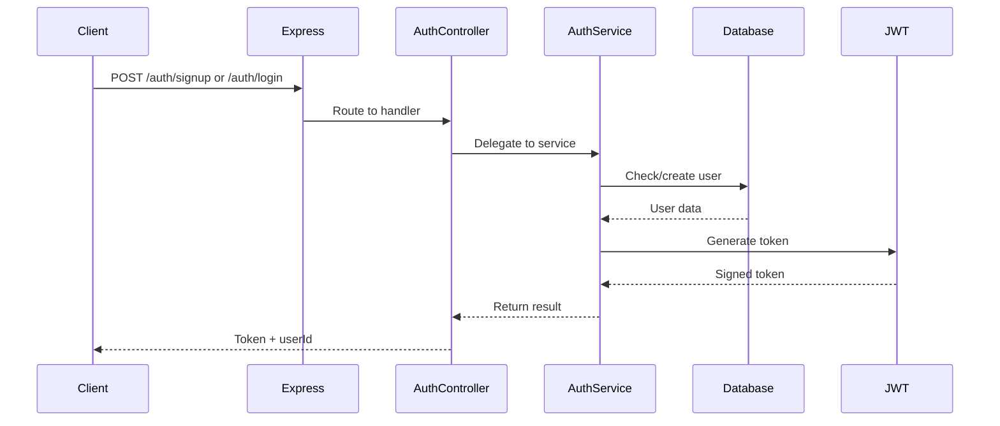
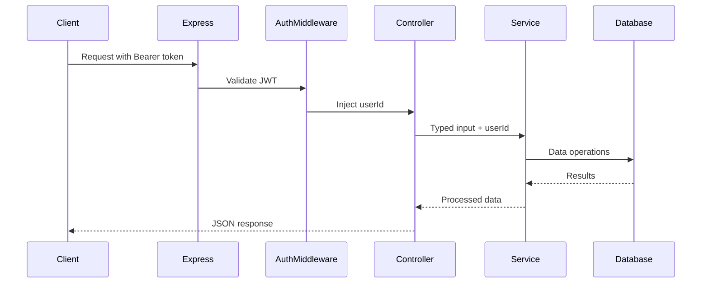
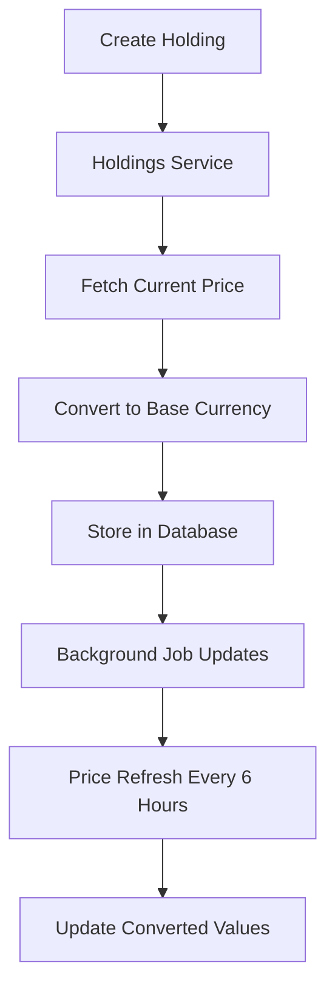
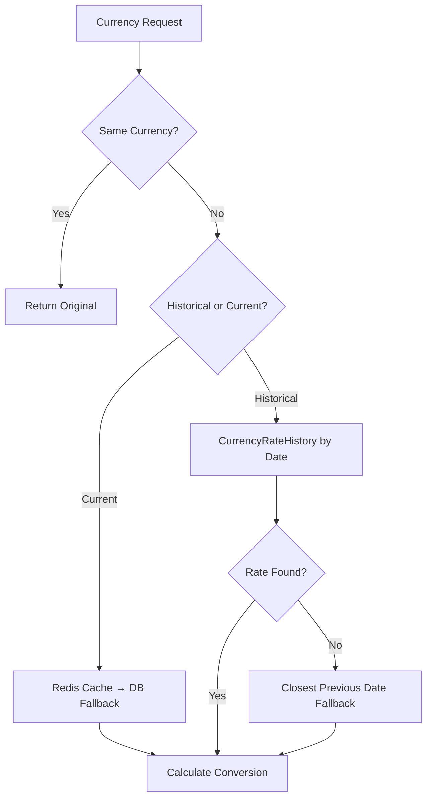
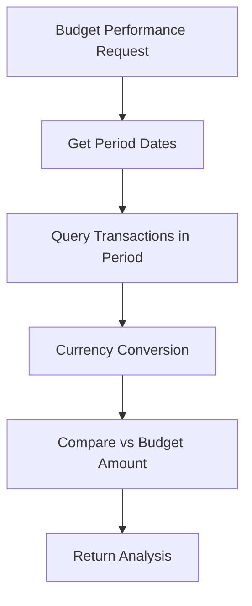

# Azerro Backend — Architecture & Flow Documentation

## System Architecture

The backend follows a **layered architecture** with clear separation of concerns.

```
┌─────────────────────────────────────────────────────┐
│                   Client Layer                       │
│            (Web/Mobile Applications)                │
└─────────────────────────────────────────────────────┘
                          │
                 HTTP/HTTPS Requests
                          │
┌─────────────────────────────────────────────────────┐
│               API Gateway Layer                     │
│           (Express.js Router + CORS)                │
└─────────────────────────────────────────────────────┘
                          │
┌─────────────────────────────────────────────────────┐
│             Middleware Layer                         │
│  • JWT Authentication  • Rate Limiting (Redis)      │
│  • Error Handling      • Request Validation (Zod)   │
└─────────────────────────────────────────────────────┘
                          │
┌─────────────────────────────────────────────────────┐
│              Controller Layer                        │
│  • Request/Response handling  • Authorization       │
│  • Input extraction           • HTTP status codes   │
└─────────────────────────────────────────────────────┘
                          │
┌─────────────────────────────────────────────────────┐
│               Service Layer                         │
│  • Business logic      • Database operations        │
│  • External APIs       • Currency conversion        │
│  • Structured errors   • Cache management           │
└─────────────────────────────────────────────────────┘
                          │
            ┌─────────────┴─────────────┐
            │                           │
┌───────────────────────┐  ┌───────────────────────────┐
│    Cache Layer        │  │     Database Layer        │
│      (Redis)          │  │     (PostgreSQL)          │
│ • Exchange rates      │  │ • Data persistence        │
│ • AI response cache   │  │ • Relationships           │
│ • Resilient wrappers  │  │ • Constraints             │
└───────────────────────┘  └───────────────────────────┘
```


## Project Structure

```
src/
├── controllers/          # HTTP request handlers
├── services/             # Business logic and database operations
│   └── brokers/          # Broker integrations (INDMoney, factory)
├── routes/               # API endpoint definitions
├── middlewares/          # Auth, rate limiting, error handling
├── types/               # TypeScript interfaces (service_types.ts)
├── utils/               # Shared utilities (db, redis, currency, date, price, errors)
├── validations/         # Zod validation schemas
├── jobs/                # Background cron jobs
├── scripts/             # Database seeding and maintenance
├── tests/               # Unit and integration tests
└── ai/                  # AI-powered assistant (Google ADK)
    ├── adk/
    │   ├── assistants/  # LLM agent definitions (Azerro, Friday, Jarvis)
    │   ├── tools/       # Coordinator, data, action, market, memory tools
    │   ├── runner.ts    # Session management & execution loop
    │   └── model_config.ts
    ├── controllers/     # AI tool handlers with Redis caching
    ├── services/        # AI-specific services (MCP, user memory, chat)
    ├── routes/          # AI route definition
    └── tests/           # Integration tests (fully mocked)
```


## Request Flows


### Authentication Flow


```mermaid
sequenceDiagram
    participant Client
    participant Express
    participant AuthController
    participant AuthService
    participant Database
    participant JWT

    Client->>Express: POST /auth/signup or /auth/login
    Express->>AuthController: Route to handler
    AuthController->>AuthService: Delegate to service
    AuthService->>Database: Check/create user
    Database-->>AuthService: User data
    AuthService->>JWT: Generate token
    JWT-->>AuthService: Signed token
    AuthService-->>AuthController: Return result
    AuthController-->>Client: Token + userId
```


### Protected Resource Flow


```mermaid
sequenceDiagram
    participant Client
    participant Express
    participant AuthMiddleware
    participant Controller
    participant Service
    participant Database

    Client->>Express: Request with Bearer token
    Express->>AuthMiddleware: Validate JWT
    AuthMiddleware->>Controller: Inject userId
    Controller->>Service: Typed input + userId
    Service->>Database: Data operations
    Database-->>Service: Results
    Service-->>Controller: Processed data
    Controller-->>Client: JSON response
```


## Core Patterns


### Controller Pattern

Controllers handle HTTP concerns and delegate all logic to services:

```typescript
export const createGoal = asyncHandler(async (req: AuthRequest, res: Response) => {
    if (!req.userId) return res.status(401).json({ error: 'Unauthorized' });

    const { name, targetAmount, targetDate, description, savedAmount } = req.body;
    const goalInput: CreateGoalInput = { name, targetAmount, targetDate, description, savedAmount };

    const goal = await createGoalService(req.userId, goalInput);
    res.status(201).json(goal);
});
```


### Service Pattern

Services own validation, business logic, and database access:

```typescript
export const createGoal = async (userId: string, data: CreateGoalInput) => {
    if (!data.name?.trim()) {
        throw new ValidationError('Goal name is required', 'Goal', undefined,
            { field: 'name', validationType: 'business' });
    }

    return withPrismaErrorHandling(async () => {
        return await prisma.goal.create({
            data: { userId, name: data.name.trim(), targetAmount: data.targetAmount, ... },
        });
    }, 'Goal');
};
```


### Redis Caching Pattern

All Redis operations use resilient wrappers that degrade gracefully:


| Wrapper                      | Purpose                      | On Failure                  |
| ---------------------------- | ---------------------------- | --------------------------- |
| `safeGet(key)`               | Single key lookup            | Returns `null` (cache miss) |
| `safeSetex(key, ttl, value)` | Write with TTL               | Logs error, continues       |
| `safeMget(keys)`             | Batch key lookup             | Returns array of `null`s    |
| `safeBatchSetex(entries)`    | Pipelined batch write        | Logs error, continues       |
| `safeDel(...keys)`           | Delete cache keys            | Logs error, continues       |
| `safeIncrWithTTL(key, ttl)`  | Atomic increment + TTL (Lua) | Returns `null` (fail-open)  |
| `withCache(key, ttl, fn)`    | Cache-aside helper           | Falls through to `fn()`     |


**Cache key namespaces**:

- `rate:{base}:{target}` — Exchange rates (TTL until UTC midnight)
- `adk:txn:*`, `adk:goals:*`, `adk:budgets:*`, `adk:events:*`, `adk:profile:*` — AI tool data (3-10 min)
- `report:{type}:{userId}:...` — Report aggregations (10 min)
- `budget:performance:{userId}` — Budget performance (10 min)
- `price:{type}:{ticker}` — Asset prices (30 min stocks/crypto, 6 hours metals)


### Error Handling

```
asyncHandler (controller) → ValidationError / NotFoundError (service)
    → globalErrorHandler (middleware) → structured JSON response
```

Error types: `ValidationError`, `NotFoundError`, Prisma errors (via `withPrismaErrorHandling`).

## Business Logic Flows


### Holdings Management


```mermaid
graph TD
    A[Create Holding] --> B[Holdings Service]
    B --> C[Fetch Current Price]
    C --> D[Convert to Base Currency]
    D --> E[Store in Database]
    E --> F[Background Job Updates]
    F --> G[Price Refresh Every 6 Hours]
    G --> H[Update Converted Values]
```


Price sources: Finnhub (stocks), CoinGecko (crypto), metals.live (metals).

### Currency Conversion


```mermaid
graph TD
    A[Currency Request] --> B{Same Currency?}
    B -->|Yes| C[Return Original]
    B -->|No| D{Historical or Current?}
    D -->|Current| E[Redis Cache → DB Fallback]
    D -->|Historical| F[CurrencyRateHistory by Date]
    E --> G[Calculate Conversion]
    F --> H{Rate Found?}
    H -->|Yes| G
    H -->|No| I[Closest Previous Date Fallback]
    I --> G
```


### Budget Performance


```mermaid
graph TD
    A[Budget Performance Request] --> B[Get Period Dates]
    B --> C[Query Transactions in Period]
    C --> D[Currency Conversion]
    D --> E[Compare vs Budget Amount]
    E --> F[Return Analysis]
```


### Goal Conflict Detection

Analyzes whether a user can achieve all active goals based on monthly income, calculating required monthly savings for each goal and flagging if total exceeds available income.

## API Endpoints (54 total)


### Auth (`/auth`) — 2

`POST /signup` · `POST /login`

### User (`/user`) — 2

`GET /me` · `PUT /preferences`

### Bank Accounts (`/bank-accounts`) — 4

`GET /` · `POST /` · `PUT /:id` · `DELETE /:id`

### Transactions (`/transactions`) — 4

`GET /` · `POST /` · `PUT /:id` · `DELETE /:id`

### Holdings (`/holdings`) — 5

`GET /` · `GET /history` · `POST /` · `PUT /:id` · `DELETE /:id`

### Goals (`/goals`) — 7

`GET /` · `GET /conflicts` · `GET /:id` · `POST /` · `POST /:id/contribute` · `PUT /:id` · `DELETE /:id`

### Planned Events (`/planned-events`) — 6

`GET /` · `POST /` · `PUT /complete/:id` · `PUT /reset/:id` · `PUT /:id` · `DELETE /:id`

### Budgets (`/budgets`) — 5

`GET /` · `GET /performance` · `POST /` · `PUT /:id` · `DELETE /:id`

### Reports (`/reports`) — 8

`GET /expenses-summary` · `GET /monthly-income-expense` · `GET /income-vs-expense` · `GET /category-breakdown` · `GET /asset-allocation` · `GET /budget-vs-actual` · `GET /goal-progress` · `GET /recurring-transactions`

### AI (`/ai`) — 1

`POST /assistant`

### Brokers (`/brokers`) — 10

`POST /:broker/connect` · `GET /indmoney/callback` · `GET /:broker/status` · `POST /:broker/sync` · `POST /:broker/disconnect` · `GET /:broker/search` · `GET /:broker/instrument/:symbol` · `GET /memory/all` · `POST /memory/save` · `DELETE /memory/:category/:key`

## Background Jobs


| Job                    | Schedule      | Description                                      |
| ---------------------- | ------------- | ------------------------------------------------ |
| Currency Rate Refresh  | `0 */6 * * *` | Fetch rates, update DB + Redis, store historical |
| Holdings Price Refresh | `0 */6 * * *` | Batch price updates by asset type                |
| Database Maintenance   | `0 2 1 * *`   | VACUUM FULL, REINDEX, ANALYZE                    |


## Security

- **JWT** — 7-day expiry, bcrypt password hashing
- **User Isolation** — All resources filtered by `userId`
- **Rate Limiting** — Redis-backed atomic counters (Lua script)
- **Input Validation** — Zod schemas on request bodies
- **Parameterized Queries** — Prisma prevents SQL injection
- **PII Protection** — Sensitive fields redacted in error logs


## Deployment


### Docker Compose (Production)

```yaml
services:
  redis:
    image: redis:7
    command: redis-server --appendonly yes
  backend:
    image: asia-south1-docker.pkg.dev/.../azerro-backend:latest
    depends_on: redis
    env_file: .env
```


### Dockerfile (Multi-stage)

```dockerfile
FROM node:20-slim AS build
RUN npm ci && npx prisma generate && npm run build

FROM node:20-slim AS production
RUN npm ci --omit=dev && npx prisma generate
CMD ["sh", "-c", "npx prisma migrate deploy && node dist/index.js"]
```


### CI/CD

GitHub Actions builds and pushes to Google Artifact Registry, then deploys to VM.

## Testing

All tests run fully mocked (no external services):

- **Prisma** — Mocked via Vitest module mocks
- **Redis** — Safe wrappers mocked in test setup
- **AI Runner** — `runAssistant` mocked per test
- **Auth** — Middleware injected in integration tests

```bash
npm run test          # All tests
npm run test:ai       # AI module tests
npm run test:main     # Core tests
```

